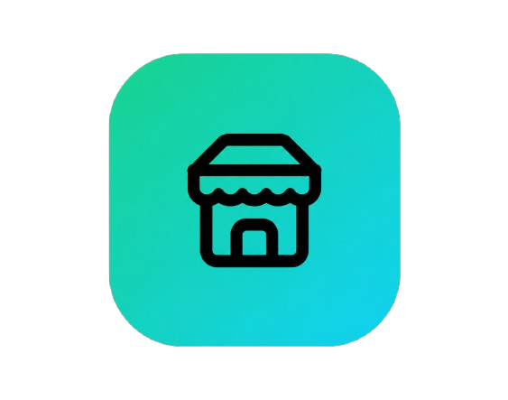

<h1> <strong>volvyPOS</strong></h1>

  
  
  

## 🚀 Description

**volvyPOS** est une application moderne de **gestion de stock + point de vente (POS)** conçue pour les petites boutiques.

Rapide, simple et **100% offline**, elle permet de gérer facilement les ventes, produits, stocks et paiements, avec la possibilité de connecter plusieurs postes via le réseau LAN.

---

## ✨ Fonctionnalités

- 🛍️ Gestion des produits (prix, stock, catégorie, code-barres)
- 💳 Interface POS (panier, quantités, total, paiements, remises)
- 🧾 Génération de reçus (PDF, thermique, A4, A5, Half Letter...)
- 📦 Mise à jour automatique du stock
- 📊 Tableau de bord (chiffre d’affaires, alertes)
- 📈 Rapports (jour, mois, année + export Excel/PDF)
- 🔐 Authentification par rôle (Admin / Manager / Caissier / Gestion Stock)
- 📥 Import de produits via CSV
- 🔄 Synchronisation LAN Client/Serveur
- 🔍 Support des scanners de codes-barres USB, Bluetooth et caméra
- 🌐 Interface multilingue (Français, Anglais, Español)
  
---

## 🌐 Mode Client / Serveur

volvyPOS prend en charge une architecture **Client/Serveur via réseau LAN**.

- 🖥️ **Serveur** — centralise les données et services du POS
- 💻 **Client** — se connecte au serveur via le réseau local
- 🔄 **Synchronisation en temps réel** entre les postes
- 👥 Plusieurs postes peuvent fonctionner simultanément
- 🗄️ Les données sont centralisées sur le serveur

---

## ⚙️ Technologies

- **Frontend :** React + Vite
- **Backend :** Node.js + Express
- **Base de données :** SQLite
- **Communication :** API + WebSocket
- **Réseau :** LAN

---

## 🌐 Mode hors ligne

volvyPOS peut fonctionner **sans connexion Internet**.

- Fonctionne sans Internet
- Données stockées localement
- Idéal pour les commerces et points de vente
- Le réseau LAN permet la communication entre les différents postes

---

## 🖨️ Périphériques compatibles

- 🧾 Imprimantes thermiques 58 mm / 80 mm
- 🖨️ Imprimantes standard
- 🔍 Scanners de codes-barres USB
- 📡 Scanners Bluetooth
- 📷 Scanner via caméra

---

## 🧾 Formats de reçus

- 🧾 Ticket thermique 58 mm
- 🧾 Ticket thermique 80 mm
- 📄 Half Letter — 8.5 × 5.5" Landscape
- 📄 A4
- 📄 PDF

---

## ▶️ Installation

### Windows

1. Téléchargez la dernière version de **volvyPOS (.exe)** depuis la page **Releases** de GitHub.
2. Exécutez le fichier `.exe` téléchargé.
3. Suivez les instructions d'installation.
4. Lancez **volvyPOS** depuis le raccourci créé sur votre ordinateur.

> ⚠️ **Important :** téléchargez toujours la dernière version disponible dans les **Releases officielles de volvyPOS**.

---

### 🔐 Identifiants par défaut

| Rôle | Identifiant | Mot de passe |
|------|-------------|--------------|
| 👑 **Admin** | `admin` | `admin123` |
| 💵 **Caissier** | `caissier` | `caisse123` |

> ⚠️ **Important :** changez les mots de passe par défaut après la première connexion afin de sécuriser votre installation.

---

## 🖥️ Version Desktop

Compatible avec **Windows** — installation via fichier `.exe`.

---

## 🔒 Sécurité

- 🔐 Authentification par rôle
- 👥 Gestion des permissions selon le profil utilisateur
- 🛡️ Accès différencié Admin / Manager / Caissier / Gestion Stock
- 🗄️ Données locales et centralisées selon le mode d'utilisation
- 🔄 Synchronisation Client/Serveur via réseau LAN

---

## 📌 À venir

- ☁️ Version Cloud optionnelle
- 🌐 Accès à distance au POS

---

## ❤️ Soutenir VolvyPOS

Donnez-nous une ⭐ sur GitHub pour soutenir le projet !

### Contact

Veuillez ouvrir une **Issue** sur GitHub ou **volvypos@outlook.com**

---

⭐ **volvyPOS — Simple, rapide et efficace pour votre commerce.**
